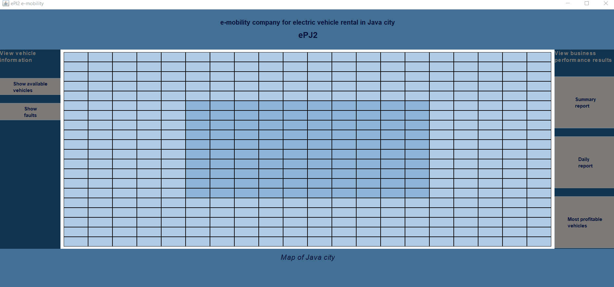

# E-Mobility Rental Simulation System

## Project Overview

This is a Java desktop application that simulates the business operations of a fictional **e-mobility company** called **ePJ2**, which rents electric vehicles such as **cars, bicycles, and scooters** within the *Java city*.  
The program processes predefined datasets describing vehicles, rentals, and failures, and it generates detailed **financial reports** and **summaries of business performance**, along with **visual simulations** of vehicle movements on a city map. In addition, it generates invoice for each rental.

The application is implemented in **Java** using the **Swing** graphical interface and emphasizes multithreading, file operations, serialization, and object-oriented design. All classes and methods are **documented using Javadoc**.

## Key Features

### Vehicle Management
- Vehicle data is read from a `.csv` file, representing all vehicles owned by the company.
- Application supports three types of vehicles (car, bike, scooter). 
- Each vehicle can experience **failures**, which are recorded with date, time, and description.
- All vehicles consume battery power while moving and can recharge when their battery is depleted.

### Rental Simulation
- Rental data is read from a `.csv` file. 
- Every rental record contains: 
  - the rental date and time,  
  - the user's name,  
  - start and end locations (map coordinates),  
  - duration in seconds,  
  - whether a fault occurred, and  
  - whether a promotion was applied.
- Simulation runs in **multiple threads**, one per rental, sorted chronologically.
- Vehicles move across a **20x20 city map** divided into:
  - **Dark Blue fields:** inner city zone  
  - **Light Blue fields:** outer city zone  
- Movement is animated in real-time, showing vehicle ID and current battery level.

### Pricing and Billing
- Rental prices are calculated per second based on vehicle type:
  - **Car:** `CAR_UNIT_PRICE * duration`
  - **Bicycle:** `BIKE_UNIT_PRICE * duration`
  - **Scooter:** `SCOOTER_UNIT_PRICE * duration`
- Prices are adjusted using parameters from external **`.properties` files**:
  - Distance zones: `DISTANCE_NARROW`, `DISTANCE_WIDE`
  - Discounts: `DISCOUNT` (every 10th rental)
  - Promotions: `DISCOUNT_PROM` (active promotions)
- If a fault occurs during the rental, the total price is set to `0`.
- A **detailed invoice** (`.txt` file) is generated for each rental, listing all components (base price, discounts, promotions, etc.).

### 4. Reports and Analytics

#### **Summary Report**
Displays:
1. Total revenue (sum of all receipts)  
2. Total discount amount  
3. Total promotion amount  
4. Total income from inner and outer city zones  
5. Maintenance cost  
6. Repair cost  
7. Company expenses  
8. Tax 

#### **Daily Reports**
- Same data (1–6), grouped by date.  

*Summary and daily reports are displayed within the application and also exported as **`.txt` files***

#### **Most Profitable Vehicles**
- For each vehicle type, determines which unit generated the **highest revenue**.  
- These data are **serialized** as binary files and can later be **deserialized** and viewed in a dedicated interface.

### 5. Graphical User Interface (GUI)

The program includes several **interactive screens** implemented in **Swing**:

- **Main Map View:**  
  Displays the 20×20 grid representing the city, with vehicles moving across fields in real time. The narrow area of the city is represented with a darker color than the wider area.
- **Vehicle Overview:**  
  Three tables showing all cars, bicycles, and scooters with their attributes.  
- **Fault Report**  
  Table listing vehicle type, ID, time, and failure description.  
- **Business Reports:**  
  Displays both daily and summary financial statistics in a clear, tabular format.  
- **Serialized Data View:**  
  Allows loading and displaying the most profitable vehicles per category.

## Program Demonstration

The following section demonstrates the application in action.

### 1. Simulation of Vehicle Movement

The first GIF below illustrates the **real-time simulation of vehicle movement** on the 20×20 city map.  
Only three vehicles are displayed moving simultaneously on the map at a time, each at its own speed, to keep the simulation clear and avoid overcrowding the map. The simulation proceeds sequentially according to rental dates and times. As soon as all three complete their respective routes, the next set of rentals starts automatically.  

During the simulation:
- The map dynamically displays the **current position**, **ID**, and **battery level** of each vehicle.  
- **Buttons for reports**  are **disabled** while the simulation is running, ensuring that data cannot be accessed or modified before completion.  
- The **terminal** simultaneously outputs detailed simulation logs — including events such as: 
  - when a vehicle starts moving 
  - when a vehicle stops to recharge its battery,
  - when a vehicle finishes its route, or  
  - when a fault occurs

---

### 2. Viewing Reports and Results

After the simulation ends, all analytical and financial data become available.  
The second GIF below shows the **reports viewing**, where users can access:
- Daily reports
- Summary report
- Most profitable vehicles per category
- All vehicles owned and rented by the company
- Report of all vehicle malfunctions

---

### 3. Invoice Generation

Each completed rental automatically produces a detailed **invoice** (`.txt` file). If the rented vehicle is a **car**, the invoice additionally includes the **driver’s license number**, and **ID card number** (for domestic users) or **passport number** (for foreign users).  

The examples below show two types of generated invoices:
- **First invoice:** shows a case where the vehicle completed the rental **without any malfunction**.

    

- **Second invoice:** shows a case where a **fault occurred** 

    

## How to Run the Program

1. Open the project in **IntelliJ IDEA** or **Eclipse**.  
2. Configure paths and coefficients in the properties files  
3. Run the RentalSimulation class
4. The program will:
    - Load vehicle and rental data from CSV files  
    - Simulate vehicle movements on the city map  
    - Generate receipts after each rental  
    - Produce structured and organized reports 